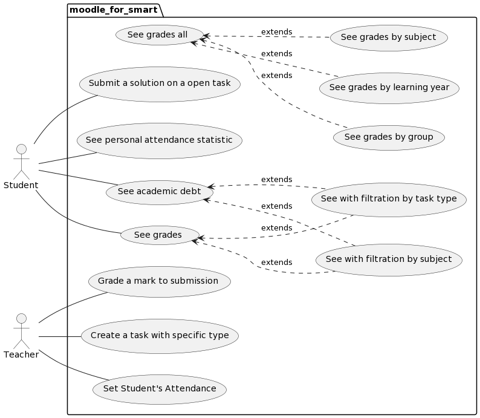
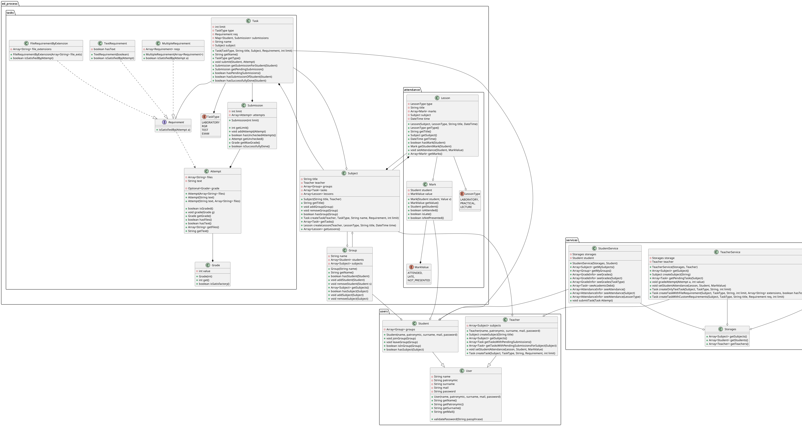
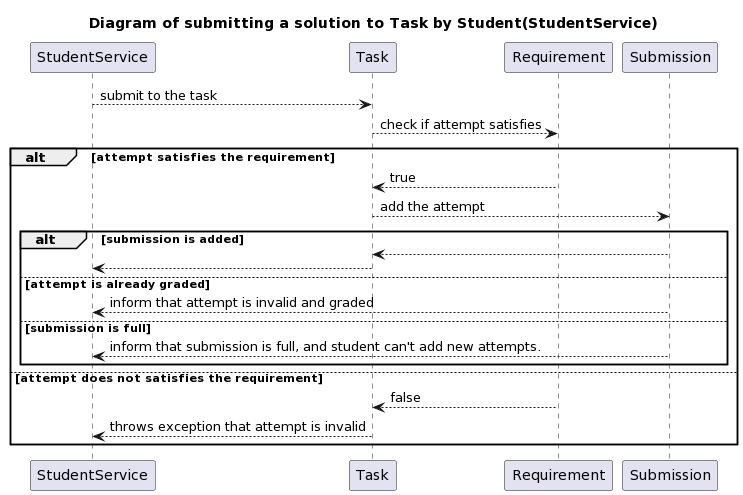

# A ~~Moodle~~

This project was designed and implemented during the course
"Software Development Theory".

## Design

The use-cases:

Object-Oriented Design:

Sequences Diagram:

## Implementation

The project was implemented in [Java](https://www.java.com/en/),
and it has unit-tests written using [JUnit](https://junit.org/junit5/).